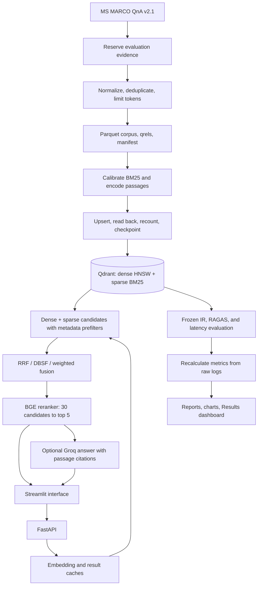

# PrecisionRAG

**Vector Database Design for Large-Scale Precision Retrieval in RAG Systems**  
Team **eyaaduhcaam** · ADROSONIC BUILD 2026 · Problem Statement 1

PrecisionRAG combines semantic search, BM25 keyword retrieval, configurable fusion, and cross-encoder reranking over **100,000 and 500,000 MS MARCO passages**. It provides a Streamlit interface, a FastAPI backend, metadata filtering, optional cited answers, and reproducible retrieval-quality and latency evaluations.

The retrieval stack runs locally. Optional answer generation and RAGAS judging use Groq. The implementation uses Qdrant as its vector database and adds the ingestion, retrieval, validation, API, and evaluation layers around it.

**Documentation verified: 4 October 2026.** Results below come from saved evaluation artifacts and a separate live comparison of the two local applications.

## Highlights

- **500K passages indexed:** separate collections and artifacts for 100K and 500K.
- **Three retrieval modes:** dense, hybrid, and hybrid with reranking.
- **Configurable fusion:** Reciprocal Rank Fusion (RRF), Distribution-Based Score Fusion (DBSF), and weighted fusion.
- **GPU support:** ONNX dense embedding and cross-encoder inference on CUDA.
- **Metadata prefilters:** source and category constraints applied inside retrieval.
- **Explainable rankings:** dense, sparse, fused, and reranked position information.
- **Query caching:** embedding and result caches with TTL and bounded capacity.
- **Verified ingestion:** resumable checkpoints, vector checks, read-back, and exact counts.
- **Evaluation evidence:** RAGAS, label-based IR metrics, raw latency logs, and recalculated reports.

## Recorded results

### Retrieval quality and latency

| Corpus | Retrieval mode | RAGAS context precision | RAGAS context recall | MRR@10 | Label Recall@5 | p95 latency |
|---|---|---:|---:|---:|---:|---:|
| 100K | Dense baseline | 0.8055 | 0.9000 | 0.6061 | 0.8700 | 30.0 ms |
| 100K | Hybrid + RRF + reranking | **0.8998** | **0.9000** | **0.7149** | **0.9100** | 191.2 ms |
| 500K | Dense baseline | 0.8153 | **0.9000** | 0.5757 | 0.7900 | 25.6 ms |
| 500K | Hybrid + RRF + reranking | **0.8340** | 0.8500 | **0.6708** | **0.8500** | 168.3 ms |

**Measurement protocol:** 20 RAGAS queries per mode, 100 frozen IR queries, and 100 consecutive top-5 latency queries after warmup. Result and embedding caches were disabled; explanations were off. Latency includes query encoding, database access, fusion, and applicable reranking. It excludes HTTP transport, browser rendering, and answer generation. Both neural components were recorded as using CUDA.

- At **100K**, context precision improved by **9.43 percentage points**, with context recall unchanged.
- At **500K**, context precision improved by **1.87 percentage points**, while context recall decreased by **5 percentage points**.
- Both optimized runs exceeded the absolute targets of context precision > 0.75 and context recall > 0.70, with recorded retrieval p95 < 300 ms.
- The 500K run does **not** establish improvement on every required quality dimension. Its 20-query precision-difference confidence interval includes zero.
- The lower recorded p95 at 500K is not evidence that increasing corpus size makes retrieval faster; these runs are not a controlled scaling-speedup experiment.

Source reports:

- [100K benchmark](reports/runs/20261003T232939490704Z/benchmark_report.md)
- [500K benchmark](reports/500k/runs/20261004T004110057291Z/benchmark_report.md)

### Ingestion

| Corpus | Qdrant collection | Recorded ingestion time | Under 2 hours |
|---|---|---:|---|
| 100,000 passages | `msmarco_v21_100k_final` | 174.9 s / 2.9 min | Yes |
| 500,000 passages | `msmarco_v21_500k` | 867.6 s / 14.5 min | Yes |

The recorded ingestion interval includes model loading, encoding, writes, validation, and HNSW optimization. Dataset download and corpus construction are separate stages; interrupted downtime is excluded. These CUDA measurements supersede the earlier CPU ingestion result preserved in the archive.

The tested laptop has a Ryzen 7 6800HS, 16 GB RAM, and an RTX 3060 Laptop GPU with 6 GB VRAM. A 500K collection contains 500K passage points with dense and sparse representations; this does not mean one million passages.

## System architecture



Dense-only mode bypasses sparse retrieval, fusion, and reranking. Hybrid mode combines the two retrieval branches without the cross-encoder.

### Current settings

| Component | Configuration |
|---|---|
| Dense encoder | `BAAI/bge-small-en-v1.5`, 384 dimensions, cosine similarity |
| Sparse encoder | `Qdrant/bm25`, k1 = 1.2, b = 0.75; corpus-calibrated average length |
| Vector database | Qdrant 1.16.2 |
| Dense index | HNSW M = 16, ef_construct = 128 |
| Quantization | INT8, original dense vectors on disk, rescoring enabled |
| Search | hnsw_ef = 256, oversampling = 2.0 |
| Hybrid candidates | 100 dense + 100 sparse candidates before fusion |
| Default fusion | RRF, k = 60 |
| Weighted alternative | Per-branch min-max normalization, alpha = 0.6 |
| Active reranker | `BAAI/bge-reranker-base`, via `retrieval.reranker` |
| Reranker fallback | `Xenova/ms-marco-MiniLM-L-6-v2`, when the override is removed |
| Reranking depth | Top 30 fused candidates; return top 5 by default |
| Caches | LRU, 2,048 entries, 120-second TTL |
| Optional generator / judge | `openai/gpt-oss-120b` through Groq, temperature 0 |

These settings are in `config.yaml` and `config.500k.yaml`. The configured default RAGAS sample is 50; the reported runs explicitly used 20.

## Dataset and validation

The corpus builder streams `microsoft/ms_marco`, configuration `v2.1`, at pinned revision `a47ee7aae8d7d466ba15f9f0bfac3b3681087b3a` with seed 42.

1. Select 100 evaluation queries and 50 tuning queries from validation data.
2. Reserve their passage evidence before adding training-set distractors.
3. Normalize whitespace, assign stable 63-bit passage IDs, and merge exact duplicates and their metadata memberships.
4. Limit passages to 510 BGE tokens. Exclude evaluation rows whose labeled positive evidence would be clipped.
5. Write `corpus.parquet`, `eval_queries.jsonl`, `tuning_queries.jsonl`, `qrels.json`, and a hashed `manifest.json`.

Relevance labels use `is_selected == 1`; the first non-empty answer supplies the RAGAS reference. This is a reproducible **MS MARCO QnA subset**, not an official passage-ranking leaderboard result. Exact duplicates are removed; semantic near-duplicates are not.

| Stage | Validation / recalculation |
|---|---|
| Corpus | Recount passages; audit IDs, evidence coverage, token limits, and file hashes |
| BM25 | Recalculate corpus average document length |
| Embeddings | Check counts, dimensions, finite values, norms, and sparse indices |
| Batch upload | Wait for completion; read IDs back; verify exact build-specific count |
| Completed index | Verify every expected ID and passage text; confirm optimizer readiness |
| Evaluation | Recompute IR metrics, RAGAS means, and latency percentiles from saved artifacts |
| Live mutations | Verify write/delete outcome, clear result caches, and return updated statistics |

BM25 average document length is frozen at bulk build; Qdrant updates sparse IDF as the collection changes.

## Run locally

Run all commands from the repository root. Examples use **Windows PowerShell and Python 3.12**. Docker Desktop must be running with Linux containers. First-time setup needs internet for dependencies, models, and data. Allow disk space for both indexes, model caches, datasets, and Docker storage.

### 1. Get the repository and start Qdrant

```powershell
git clone https://github.com/justpriyanshu/Precision-RAG.git
cd Precision-RAG

if (-not (Test-Path .env)) { Copy-Item .env.example .env }
docker compose up -d qdrant
```

Qdrant is available at `http://127.0.0.1:6333`; its dashboard is at `http://127.0.0.1:6333/dashboard`. Storage persists in `qdrant_storage/`.

Add your own `GROQ_API_KEY` to `.env` for optional answers and RAGAS judging. Retrieval works without it. Keep `.env` out of version control.

### 2. Create the GPU environment

The recorded builds used CUDA. Keep GPU dependencies in a separate environment so CPU and GPU FastEmbed/ONNX packages do not overlap.

```powershell
py -3.12 -m venv .venv-gpu
.\.venv-gpu\Scripts\python.exe -m pip install -r requirements-gpu.txt

# Corpus building, UI, plotting, and remaining application dependencies
.\.venv-gpu\Scripts\python.exe -m pip install "datasets>=3.6,<5" "numpy>=1.26,<3" "pydantic>=2.9,<3" "requests>=2.32,<3" "portalocker>=2,<4" "streamlit>=1.49,<2" "pandas>=2.2,<4" "altair>=5,<7" "matplotlib>=3.9,<4"

# Evaluation and tests, without pulling in CPU FastEmbed
.\.venv-gpu\Scripts\python.exe -m pip install "ragas==0.2.15" "langchain-groq==0.3.2" "langchain>=0.3.21,<0.4" "langchain-community>=0.3.20,<0.4" "langchain-openai>=0.3,<0.4" "pytest>=8,<9" "httpx>=0.28,<1"

$env:PRAG_DENSE_DEVICE = 'cuda'
$env:PRAG_RERANK_DEVICE = 'cuda'
```

An NVIDIA driver is required. Device selection defaults to CPU unless the environment variables are set. CUDA initialization failure is reported explicitly. BM25 preprocessing and this Qdrant container run on CPU; Groq inference is remote.

For a **separate CPU environment**, install `requirements-dev.txt` and `requirements-eval.txt` into `.venv`, use its Python executable, and set both device variables to `cpu`. Build a separate CPU collection: keep the dense device consistent between indexing and querying a measured corpus. CPU performance will differ from the reported CUDA results.

### 3. Build and validate the corpus

For a new **100K** corpus:

```powershell
$env:PRAG_CONFIG = 'config.yaml'
.\.venv-gpu\Scripts\python.exe -m scripts.build_corpus --n 100000
.\.venv-gpu\Scripts\python.exe -m scripts.recalculate
.\.venv-gpu\Scripts\python.exe -m scripts.ingest
```

For a new **500K** corpus:

```powershell
$env:PRAG_CONFIG = 'config.500k.yaml'
.\.venv-gpu\Scripts\python.exe -m scripts.build_corpus --n 500000
.\.venv-gpu\Scripts\python.exe -m scripts.recalculate
.\.venv-gpu\Scripts\python.exe -m scripts.ingest
```

Skip corpus construction when its completed `manifest.json` already exists. Ingestion is resumable with the same corpus, device, and build configuration. Changing build-defining settings requires a separate collection/checkpoint. Ingestion performs its own batch and final index recalculations.

| Scale | Config | Data directory | Reports directory |
|---|---|---|---|
| 100K | `config.yaml` | `data/` | `reports/` |
| 500K | `config.500k.yaml` | `data/500k/` | `reports/500k/` |

For development, `config.small.yaml` and `scripts.build_corpus --n 2000 --smoke` provide a smaller corpus; it does not meet the submission scale requirement.

### 4. Start the application

**100K API — terminal 1:**

```powershell
$env:PRAG_CONFIG = 'config.yaml'
$env:PRAG_DENSE_DEVICE = 'cuda'
$env:PRAG_RERANK_DEVICE = 'cuda'
.\.venv-gpu\Scripts\python.exe -m uvicorn app.api:app --host 127.0.0.1 --port 8000 --workers 1
```

**100K UI — terminal 2:**

```powershell
$env:PRAG_API_URL = 'http://127.0.0.1:8000'
$env:PRAG_REPORTS_DIR = 'reports'
.\.venv-gpu\Scripts\python.exe -m streamlit run ui/streamlit_app.py --server.port 8501
```

To run **500K alongside 100K**, use two additional terminals:

```powershell
# Terminal 3: 500K API
$env:PRAG_CONFIG = 'config.500k.yaml'
$env:PRAG_DENSE_DEVICE = 'cuda'
$env:PRAG_RERANK_DEVICE = 'cuda'
.\.venv-gpu\Scripts\python.exe -m uvicorn app.api:app --host 127.0.0.1 --port 8001 --workers 1
```

```powershell
# Terminal 4: 500K UI
$env:PRAG_API_URL = 'http://127.0.0.1:8001'
$env:PRAG_REPORTS_DIR = 'reports/500k'
.\.venv-gpu\Scripts\python.exe -m streamlit run ui/streamlit_app.py --server.port 8502
```

Open `http://127.0.0.1:8501` and `http://127.0.0.1:8502`. Confirm **Connected**, the expected passage count, and sample data switched off. The UI can fall back to mock data when its API is unavailable; mock output is not benchmark evidence.

Each API process loads its own models. On limited RAM/VRAM, run one scale at a time. Use one API worker because mutation/search coordination and caches are process-local.

### 5. Evaluate and recalculate

In a separate terminal, select the intended scale and matching devices:

```powershell
$env:PRAG_CONFIG = 'config.500k.yaml' # use config.yaml for 100K
$env:PRAG_DENSE_DEVICE = 'cuda'
$env:PRAG_RERANK_DEVICE = 'cuda'

.\.venv-gpu\Scripts\python.exe -m scripts.check_groq --ragas-smoke
.\.venv-gpu\Scripts\python.exe -m eval.run_all --phase baseline --ragas-queries 20
.\.venv-gpu\Scripts\python.exe -m eval.run_all --phase core --ragas-queries 20

# Optional: dense, fusion, reranking, and filtered ablations
.\.venv-gpu\Scripts\python.exe -m eval.run_all --phase all --ragas-queries 20

# Replace RUN_ID with the completed run's directory name
.\.venv-gpu\Scripts\python.exe -m scripts.recalculate --run reports/500k/runs/RUN_ID
```

For 100K, the recalculation path is `reports/runs/RUN_ID`. Run benchmarks without concurrent UI requests or other GPU jobs. `--skip-ragas` produces an explicitly incomplete development report, not final quality evidence.

Each run saves rankings, per-query RAGAS scores, raw latency samples, configuration/environment provenance, summaries, charts, and a Markdown report. The Results tab reads the selected reports directory and latest completed run; it does not run a new LLM judge for every interactive query.

### 6. Tests

```powershell
.\.venv-gpu\Scripts\python.exe -m pytest -q
.\.venv-gpu\Scripts\python.exe -m scripts.smoke
```

The unit suite uses deterministic fixtures. The smoke test exercises real models and embedded Qdrant. Test commands are provided for reproduction; this README does not assert a newly executed test count.

## Live comparison: 100K vs 500K

On 4 October 2026, the following queries were entered into **Compare** on both connected websites. Dense, hybrid, and hybrid + rerank were executed, giving **18 result sets**.

| Query | 100K dense / hybrid / rerank | 500K dense / hybrid / rerank |
|---|---:|---:|
| `what does bant stand for in sales` | 41 / 108 / 557 ms | 679 / 187 / 541 ms |
| `appendix defined` | 27 / 118 / 560 ms | 308 / 115 / 204 ms |
| `what county is colerain ohio in` | 73 / 114 / 563 ms | 122 / 121 / 452 ms |

These are rounded backend retrieval totals displayed by the UI, with explanations enabled and default caching. They exclude browser rendering and generation. **Five of six reranked samples exceeded 300 ms.** Three selected queries cannot establish live p95, and saved benchmark p95 values do not prove the current UI meets the latency target.

### Label-based quality checks

Each selected query has one known positive passage. Label P@5 = matched labeled positives / 5; label Recall@5 = matched labeled positives / known positives.

- Dense and hybrid + rerank retained the labeled positive for all three queries at both scales: P@5 = 0.20 and Recall@5 = 1.00 per query.
- For `appendix defined` at 500K, hybrid-only missed the labeled positive in its top five: P@5 = 0.00 and Recall@5 = 0.00. Reranking recovered it at rank one from the larger candidate set.
- Other hybrid results retained their labeled positive.
- These are sparse-label checks, **not RAGAS scores**. Unlabeled passages remain unjudged and may still be relevant.

The Colerain query is ambiguous: the dataset reference names Hamilton County, while another retrieved passage concerns a distinct community in Belmont County.

### Metadata-filter check

For `appendix defined`, applying source `thoughtco.com` in hybrid + rerank mode changed source membership from 2/5 to 5/5 results on both sites. The known positive remained rank one. Displayed retrieval totals were 588 ms at 100K and 325 ms at 500K. This demonstrates source-filter compliance, not guaranteed semantic relevance for every result.

## API

Interactive API documentation: `http://127.0.0.1:8000/docs` for 100K, or port `8001` for 500K.

| Method | Route | Purpose |
|---|---|---|
| GET | `/health` | Service health |
| GET | `/stats` | Collection count and status |
| POST | `/search` | Retrieval, filters, explanations, optional generation |
| POST | `/passages` | Insert or update a passage |
| DELETE | `/passages/{pid}` | Delete a passage |

Example `/search` body:

```json
{
  "query": "appendix defined",
  "mode": "hybrid_rerank",
  "fusion": "rrf",
  "source": "thoughtco.com",
  "top_k": 5,
  "generate": false,
  "use_cache": false,
  "explain": true
}
```

Upsert/delete are implemented with verification and result-cache invalidation. They were not executed during the live retrieval comparison. Use a separate collection for mutation demos: benchmark evaluation requires an unchanged frozen corpus. Setting `PRAG_READ_ONLY=1` before API startup blocks mutation endpoints.

## Requirement coverage and remaining work

| Requirement / bonus | Evidence or status |
|---|---|
| At least 100K passages | 100K and 500K indexed |
| Dense baseline and top-5 results | Implemented and demonstrated |
| RAGAS baseline and optimized comparison | Logged at both scales, 20 judged queries per mode |
| Hybrid search and configurable fusion | RRF, DBSF, weighted fusion implemented |
| Metadata-filtered retrieval | Implemented; source filter demonstrated |
| 100-query latency benchmark | Saved logs at both scales; benchmark p95 below 300 ms |
| Indexing under two hours | Met in recorded CUDA ingestion runs |
| Cross-encoder reranker | BGE reranker implemented and measured |
| Query caching | Implemented; no cache-hit speedup claim made here |
| Optional generated answers | Groq with passage-ID citation prompting |
| Evaluation dashboard | Displays logged results; not per-query live RAGAS judging |
| Live upsert/delete | Implemented; separate live demonstration still needed |
| ColBERT / late-interaction multi-vector retrieval | Not implemented |

Priorities:

1. Reduce current interactive latency and repeat a controlled HTTP/UI benchmark.
2. Investigate the 500K context-recall regression and increase the judged sample.
3. Record complete hybrid-only, fusion, filter, and reranker ablations at 500K.
4. Demonstrate verified mutations on a separate collection.
5. Explore late interaction, cache-hit benchmarking, and domain-specific datasets as future extensions.

Citation prompting is a grounding mechanism, not proof that hallucinations are eliminated. Banking or enterprise assistants are potential applications; this project currently evaluates MS MARCO rather than a validated banking corpus.

## Repository layout

```text
app/                  Configuration, models, cache, store, retrieval, generator, API
scripts/              Corpus build, ingestion, recalculation, smoke and device checks
eval/                 IR, RAGAS, latency, analysis, tuning, evaluation orchestration
ui/                   Streamlit interface, API client, mock backend, styles
tests/                Automated tests and fixtures
docs/                 Problem statement, proposal, implementation and demo notes
config.yaml           100K configuration
config.500k.yaml       500K configuration
config.small.yaml      Development configuration
docker-compose.yml    Local Qdrant service
data/                 Generated corpora, manifests, model cache; ignored by Git
reports/              100K evaluation artifacts
reports/500k/         500K evaluation artifacts
qdrant_storage/       Persistent database storage; ignored by Git
```

Architecture was checked against implementation files and configuration at repository commit `eb5b4940daf7cde5bf4d5b1d7ff42d82fa61b3e2`. The local evaluation runner also contained uncommitted reporting changes at inspection time; preserve code/configuration provenance when reproducing the supplied reports.

## Project documents

- [Problem statement](docs/problem_statement.pdf)
- [Round 1 proposal](docs/proposal_eyaaduhcaam_PS1.pdf)
- [Implementation notes](docs/implementation-notes.md)
- [Repository](https://github.com/justpriyanshu/Precision-RAG)

